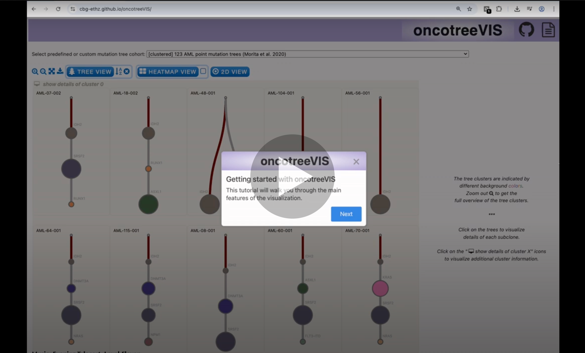

----------

# oncotreeVIS – An interactive graphical user interface for visualising mutation tree cohorts

### Web app: <a href=https://cbg-ethz.github.io/oncotreeVIS target=app>https://cbg-ethz.github.io/oncotreeVIS</a>

### Abstract

In recent years, developments in next-generation sequencing technology and computational methodology have made it possible to reconstruct, with increasing precision, the evolutionary history of tumors and their cell phylogenies, represented as mutation trees. Many mutation tree inference tools exist, yet they only provide visualizations of individual output trees, with limited amount of details, which makes it difficult to inspect the mutation trees at the cohort level and understand their differences and commonalities, an important task in computational oncology highly relevant for tumor board clinical decisions.

We introduce <b>oncotreeVIS</b>, an interactive graphical user interface for visualizing mutation tree cohorts and tree posterior distributions obtained from mutation tree inference tools. OncotreeVIS can display mutation trees that encode single or joint genetic events, such as point mutations and copy number changes, and highlight subclones with matching mutation events, conserved trajectories, drug-gene interactions, and k-nearest neighbor trees. OncotreeVIS facilitates the visual inspection of mutation tree clusters and pairwise tree distances, if provided by the user. It is available both as a JavaScript library that can be used locally or as a web application that can be accessed online to visualize seven default datasets of public mutation tree cohorts, or new user data provided in a predefined JSON format.

## Video Tutorial

## Usage

OncotreeVIS can be used as follows:
- locally by including the javascript library and calling the oncotreeVIS function with two arguments: the input in json format (<i>see below</i>) and the id of an empty div container;
- using our <a href=https://cbg-ethz.github.io/oncotreeVIS target=app>web app</a> to visualize predefined datasets or your own in the required format (see below).   

The expected input is a JSON file with the following key values: 

| Key      | Data structure |
| ----------- | ----------- |
| trees | Dictionary where the key is the sample id and the value is another dictionary containing the tree structure (required) and the sample metadata (optional).  The tree structure is an hierarchical data structure in JSON format, as used in D3.js and anytree (python) libraries. Each node has one or more child nodes (node.children), except for the leaves. In addition, each node has the following attributes: <i>node_id</i> (string/int, required), <i>matching_label</i> (required), <i>size_percent</i> (float, optional), <i>metadata</i> (dictionary, optional), <i>gene_events</i> (dictionary, optional), <i>is_neutral</i> (boolean, optional). The gene_events attribute has two predefined keys ("mutation" and "CNA"), but any other key names can be used. The values for the "CNA" event key are specifically interpreted as amplification or deletion amounts w.r.t. the neutral states. The first three letters of the event key are used in the visualization for displaying a summary for the gene events.   Example of JSON tree: "AML-03-001": {"tree": {"node_id": 0, "matching_label": 0, "children": [{"node_id": 407, "matching_label": 14, "size_percent": 0.228, "gene_events": {"FLT3-ITD": {"mutation": ""}}, "children": [{"node_id": 408, "matching_label": 5, "size_percent": 0.772, "gene_events": {"NPM1": {"mutation": "p.L287fs"}}}]}]}, "metadata": {"Chemo": "No", "Gender": "Female", "VitalStatus": "Dead NOS", "age": 59, "Diagnosis": "AML", "Response": "CR"}}  Examples for gene_events dictionary: "gene_events": {"NPM1": {"mutation": "p.L287fs"}, "AKT3": {"CNA": 2}, "JAK2": {"CNA": -1}, "TP53": {"CNA”: "-", "expression": "0.34"}}|
| clusters|List of lists of tree ids (strings).  Example: [['AML-55-001', 'AML-33-001', 'AML-57-001', 'AML-11-001'],  ['AML-77-001'], ['AML-50-001', 'AML-102-001'], … ]    Such a clustering can be obtainen e.g., with <a href=https://doi.org/10.1093/bioinformatics/btae214 target=onc>oncotree2vec</a>.|
| pairwise_tree_distances   | List of dictionaries where the keys are the tree ids of the pair of trees (strings) and the values are the distance scores (float).    Example: [{'sample_1': 'AML-73-001', 'sample_2': 'AML-22-001', 'distance': 0.6072}, … ]   A tree distance metric can be obtained e.g., with <a href=https://doi.org/10.1093/bioinformatics/btae214 target=onc>oncotree2vec</a>.|
| highlighted_genes | Styles used: color code or keywords "bold", "italic", "underline".  Example: {"JAK2": "bold", "PTEN": "italic", "TP53": "#b4a7d6", "FLT3-ITD": "lightsteelblue"} |

 The JSON files used for the predefined datasets are available on github in the <i>data</i> folder.
